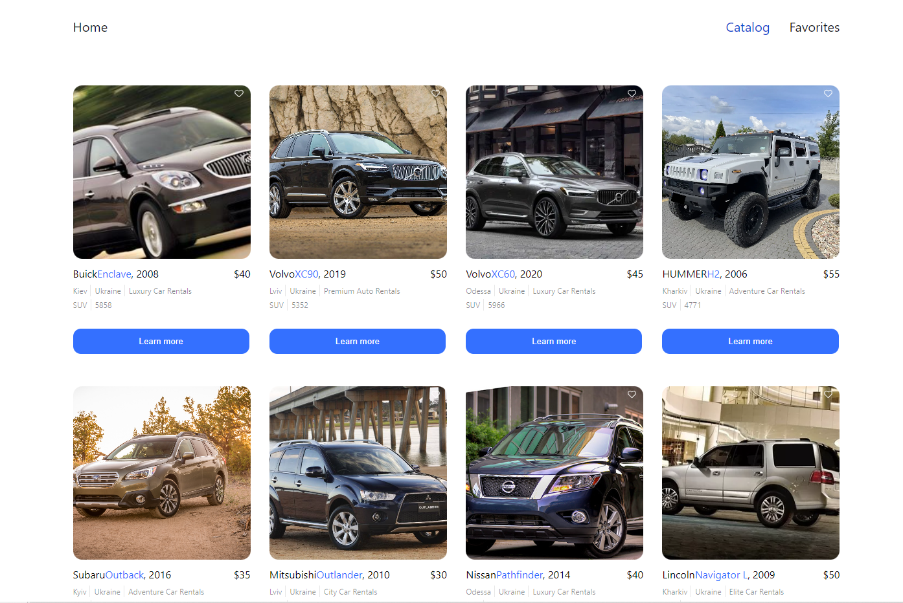
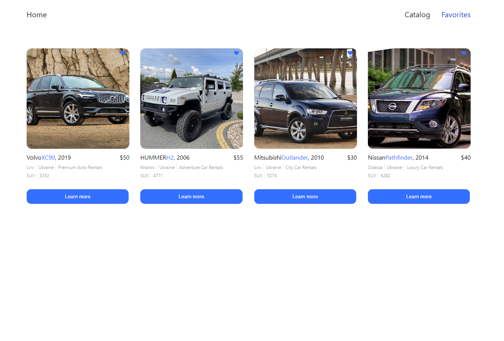

Приложение для аренды автомобилей — это веб-платформа, которая позволяет пользователям просматривать каталог автомобилей,
просматривать подробную информацию о каждом автомобиле, добавлять их в избранное и оформлять заказы на аренду.
Этот файл README содержит обзор функций приложения и инструкции по его использованию.

### Домашняя страница


На главной странице представлена информация о том, что привлекает пользователей в автофирмах.
На нем есть кнопка «Найти автомобиль», которую пользователи могут нажать, чтобы просмотреть каталог автомобилей.

### Каталог автомобилей



На странице каталога автомобилей отображается список автомобилей в виде карточек.
Каждая карта содержит:
Фотография автомобиля.
Информация о марке, модели, году выпуска автомобиля и стоимости аренды.
Кнопка «Подробнее», открывающая модальное окно с подробной информацией об автомобиле и ссылкой для его заказа.
Кнопка «Добавить в избранное» для добавления или удаления автомобилей из избранного пользователя.

### Страница избранного



На странице избранного отображаются карточки автомобилей, добавленных в избранное пользователем.
Начиная

### Использование

Домашняя страница:

Зайдя в приложение, вы попадете на главную страницу.
Прочтите информацию об автофирмах.
Нажмите кнопку «Найти автомобиль», чтобы изучить каталог автомобилей.

Каталог автомобилей:

Просмотрите список автомобилей, отображаемых в виде карточек.
Нажмите кнопку «Подробнее» на карточке, чтобы просмотреть подробную информацию об автомобиле и заказать автомобиль.
Нажмите кнопку «Добавить в избранное», чтобы добавить или удалить автомобили из избранного.

Страница избранного:

Нажмите ссылку «Избранное» в навигации, чтобы просмотреть автомобили, которые вы добавили в избранное.

### Используемые технологии

React: библиотека JavaScript для создания пользовательских интерфейсов.
Redux: библиотека управления состоянием для управления состоянием приложения.
React Router: для управления маршрутизацией и навигацией внутри приложения.
Другие библиотеки и компоненты, используемые для пользовательского интерфейса и функциональности.

### Вклад

Вклады в приложение по аренде автомобилей приветствуются. Вы можете внести свой вклад:

Сообщайте о проблемах или предложите улучшения, создавая проблемы GitHub.
Открытие запросов на включение для решения проблем или добавления новых функций.

## Создание репозитория по шаблону

Используй этот репозиторий как шаблон для создания репозитория
своего проекта. Для этого нажми на кнопку `«Use this template»` и выбери опцию
`«Create a new repository»`, как показано на изображении.


На следующем шаге откроется страница создания нового репозитория. Заполни поле
его имени, убедись что репозиторий публичный, после чего нажми кнопку
`«Create repository from template»`.


После того как репозиторий будет создан, необходимо перейти в настройки
созданного репозитория на вкладку `Settings` > `Actions` > `General` как
показано на изображении.


Проскролив страницу до самого конца, в секции `«Workflow permissions»` выбери
опцию `«Read and write permissions»` и поставь галочку в чекбоксе. Это
необходимо для автоматизации процесса деплоя проекта.


Теперь у тебя есть личный репозиторий проекта, со структурой файлов и папок
репозитория-шаблона. Далее работай с ним как с любым другим личным репозиторием,
клонируй его себе на компьютер, пиши код, делай коммиты и отправляй их на
GitHub.

## Подготовка к работе

1. Убедись что на компьютере установлена LTS-версия Node.js.
   [Скачай и установи](https://nodejs.org/en/) её если необходимо.
2. Установи базовые зависимости проекта командой `npm install`.
3. Запусти режим разработки, выполнив команду `npm start`.
4. Перейди в браузере по адресу [http://localhost:3000](http://localhost:3000).
   Эта страница будет автоматически перезагружаться после сохранения изменений в
   файлах проекта.

## Деплой

Продакшн версия проекта будет автоматически проходить линтинг, собираться и
деплоиться на GitHub Pages, в ветку `gh-pages`, каждый раз когда обновляется
ветка `main`. Например, после прямого пуша или принятого пул-реквеста. Для этого
необходимо в файле `package.json` отредактировать поле `homepage`, заменив
`your_username` и `your_repo_name` на свои, и отправить изменения на GitHub.

```json
"homepage": "https://your_username.github.io/your_repo_name/"
```

Далее необходимо зайти в настройки GitHub-репозитория (`Settings` > `Pages`) и
выставить раздачу продакшн версии файлов из папки `/root` ветки `gh-pages`, если
это небыло сделано автоматически.


### Статус деплоя

Статус деплоя крайнего коммита отображается иконкой возле его идентификатора.

- **Желтый цвет** - выполняется сборка и деплой проекта.
- **Зеленый цвет** - деплой завершился успешно.
- **Красный цвет** - во время линтинга, сборки или деплоя произошла ошибка.

Более детальную информацию о статусе можно посмотреть кликнув по иконке, и в
выпадающем окне перейти по ссылке `Details`.


### Живая страница

Через какое-то время, обычно пару минут, живую страницу можно будет посмотреть
по адресу указанному в отредактированном свойстве `homepage`. Например, вот
ссылка на живую версию для этого репозитория
[https://archgrl.github.io/rental-car-app/](https://archgrl.github.io/rental-car-app/).

Если открывается пустая страница, убедись что во вкладке `Console` нет ошибок
связанных с неправильными путями к CSS и JS файлам проекта (**404**). Скорее
всего у тебя неправильное значение свойства `homepage` в файле `package.json`.

### Маршрутизация

Если приложение использует библиотеку `react-router-dom` для маршрутизации,
необходимо дополнительно настроить компонент `<BrowserRouter>`, передав в пропе
`basename` точное название твоего репозитория. Слеш в начале строки обязателен.

```jsx
<BrowserRouter basename="/your_repo_name">
  <App />
</BrowserRouter>
```

## Как это работает


1. После каждого пуша в ветку `main` GitHub-репозитория, запускается специальный
   скрипт (GitHub Action) из файла `.github/workflows/deploy.yml`.
2. Все файлы репозитория копируются на сервер, где проект инициализируется и
   проходит линтинг и сборку перед деплоем.
3. Если все шаги прошли успешно, собранная продакшн версия файлов проекта
   отправляется в ветку `gh-pages`. В противном случае, в логе выполнения
   скрипта будет указано в чем проблема.