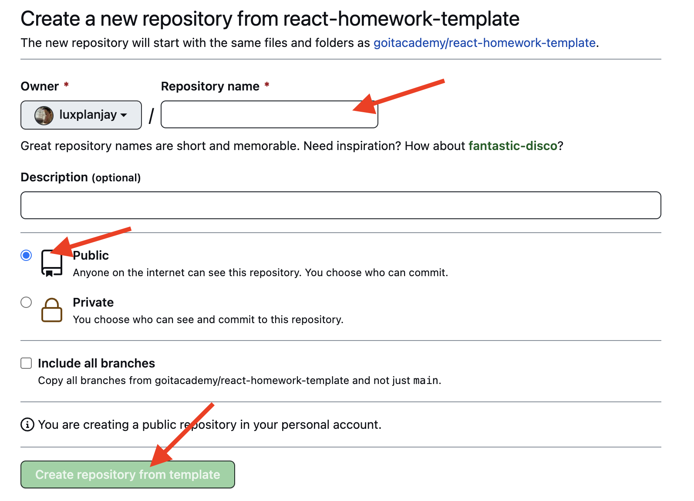

The Car Rental Application is a web-based platform that allows users to browse a catalog of cars,
view detailed information about each car, add them to their favorites, and place rental orders.
This README provides an overview of the application's features and instructions on how to use it.

### Home Page


The home page provides information about what attracts users to auto firms.
It features a "Find a Car" button that users can click to explore the car catalog.

### Car Catalog


The car catalog page displays a list of cars in the form of cards.
Each card contains:
A photo of the car.
Information about the car's make, model, year of manufacture, and rental price.
A "Learn More" button that opens a modal with detailed car information and a link to order it.
An "Add to Favorites" button to add or remove cars from the user's favorites.

### Favorites Page


The favorites page displays cards for cars that have been added to the user's favorites.
Getting Started

### Usage

Home Page:

Upon visiting the application, you'll land on the home page.
Read the information about auto firms.
Click the "Find a Car" button to explore the car catalog.

Car Catalog:

Browse through the list of cars displayed as cards.
Click the "Learn More" button on a card to view detailed car information and order the car.
Click the "Add to Favorites" button to add or remove cars from your favorites.

Favorites Page:

Click the "Favorites" link in the navigation to view the cars you've added to your favorites.

### Technologies Used

React: A JavaScript library for building user interfaces.
Redux: A state management library for managing application state.
React Router: For handling routing and navigation within the application.
Other libraries and components used for UI and functionality.

### Contributing

Contributions to the Car Rental Application are welcome. You can contribute by:

Reporting issues or suggesting enhancements by creating GitHub issues.
Opening pull requests to address issues or add new features.

## Creating a repository by template

Use this repository as a template for creating a repository
of your project. To use it just tap the `«Use this template»` button and choose
`«Create a new repository»` option, as you can see on the image below.


The page for creating a new repository will open on the next step. Fill out
the Name field and make sure the repository is public, then click
`«Create repository from template»` button.



You now have a personal project repository, having a repository-template file 
and folder structure. After that, you can work with it as you would with any 
other private repository: clone it on your computer, write code, commit, and 
send it to GitHub.

## Preparing for coding

1. Make sure you have an LTS version of Node.js installed on your computer.
   [Download and install](https://nodejs.org/en/) if needed.
2. Install the project's base dependencies with the `npm install` command.
3. Start development mode by running the `npm start` command.
4. Go to [http://localhost:3000](http://localhost:3000) in your browser. This
   page will automatically reload after saving changes to the project files.

## Deploy

The production version of the project will automatically be linted, built, and
deployed to GitHub Pages, in the `gh-pages` branch, every time the `main` branch
is updated. For example, after a direct push or an accepted pull request. To do
this, you need to edit the `homepage` field in the `package.json` file,
replacing `your_username` and `your_repo_name` with your own, and submit the
changes to GitHub.

```json
"homepage": "https://your_username.github.io/your_repo_name/"
```

Next, you need to go to the settings of the GitHub repository (`Settings` >
`Pages`) and set the distribution of the production version of files from the
`/root` folder of the `gh-pages` branch, if this was not done automatically.


### Deployment status

The deployment status of the latest commit is displayed with an icon next to its
ID.

- **Yellow color** - the project is being built and deployed.
- **Green color** - deployment completed successfully.
- **Red color** - an error occurred during linting, build or deployment.

More detailed information about the status can be viewed by clicking on the
icon, and in the drop-down window, follow the link `Details`.


### Live page

After some time, usually a couple of minutes, the live page can be viewed at the
address specified in the edited `homepage` property. For example, here is a link
to a live version for this repository
[https://archgrl.github.io/rental-car-app/](https://archgrl.github.io/rental-car-app/).

If a blank page opens, make sure there are no errors in the `Console` tab
related to incorrect paths to the CSS and JS files of the project (**404**). You
most likely have the wrong value for the `homepage` property in the
`package.json` file.

### Routing

If your application uses the `react-router-dom` library for routing, you must
additionally configure the `<BrowserRouter>` component by passing the exact name
of your repository in the `basename` prop. Slashes at the beginning and end of
the line are required.

```jsx
<BrowserRouter basename="/your_repo_name/">
  <App />
</BrowserRouter>
```

## How it works


1. After each push to the `main` branch of the GitHub repository, a special
   script (GitHub Action) is launched from the `.github/workflows/deploy.yml`
   file.
2. All repository files are copied to the server, where the project is
   initialized and linted and built before deployment.
3. If all steps are successful, the built production version of the project
   files is sent to the `gh-pages` branch. Otherwise, the script execution log
   will indicate what the problem is.